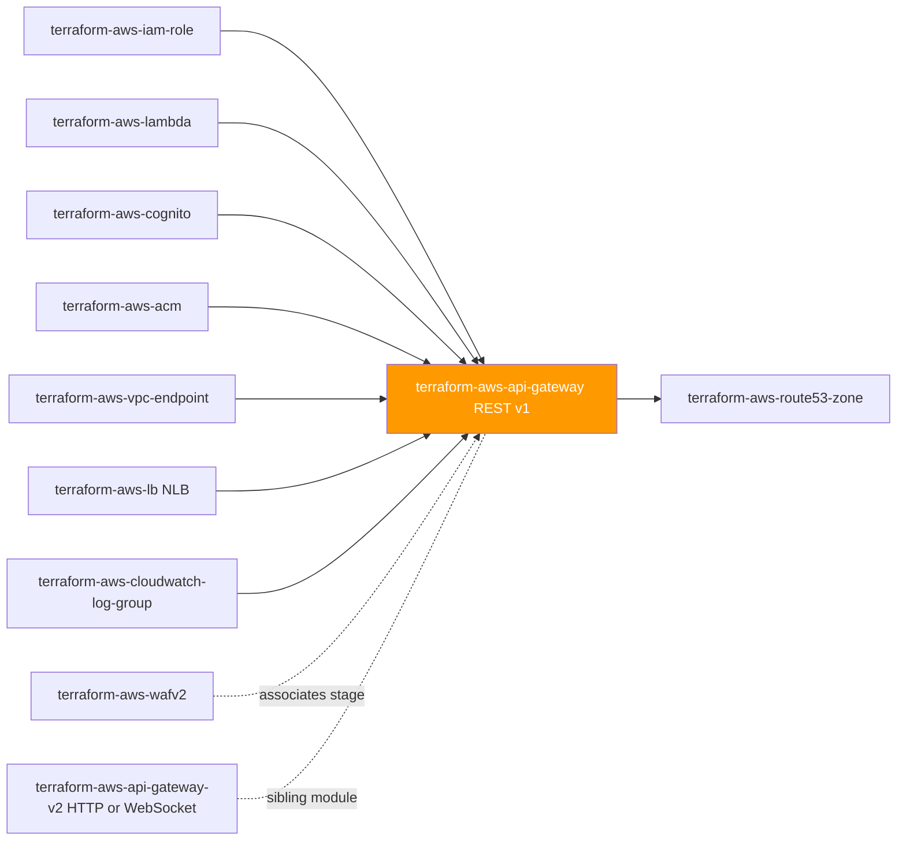

# 🟧 AWS **API Gateway (REST APIs, V1)** Terraform Module

> **Provisions a complete Amazon API Gateway V1 REST API — resource tree, methods, integrations, authorizers, models, deployment, stages, custom domains, usage plans/API keys, VPC Links, and gateway responses — from one module call, REGIONAL and X-Ray-traced by default.** Built for the AWS provider **v6.x**.

[](https://www.terraform.io)
[](https://registry.terraform.io/providers/hashicorp/aws/latest)
[](#)
[](#)
[](#)

---

## 🧩 Overview

- 🌳 **One REST API, fully wired.** Creates `aws_api_gateway_rest_api` plus the entire self-referential resource tree, methods, integrations, method/integration responses, authorizers, models, request validators, a deployment, stages, custom domains, usage plans, API keys, VPC Links, gateway responses, client certificates, and documentation artifacts.
- 🔒 **REGIONAL by default, not EDGE.** `endpoint_configuration.types` defaults to `["REGIONAL"]` — the baseline — overriding AWS's own implicit `["EDGE"]` default. Choose `["EDGE"]` or `["PRIVATE"]` deliberately.
- 🚫 **Authorization is never silently `"NONE"`.** Every `methods[*]` entry requires an explicit `authorization` value — there is no default to fall back on, so an open method is always a conscious choice, not an accident.
- 🩻 **X-Ray tracing on by default.** `stages[*].xray_tracing_enabled` defaults to `true` — the observability baseline for a regulated FI.
- 🙈 **No accidental PII in logs.** `method_settings[*].settings.data_trace_enabled` defaults to `false` — full request/response body logging can leak PII into CloudWatch Logs, so it is opt-in per method.
- 🌲 **Self-referential resource tree.** `resources[*].parent_key` can reference any other key in the same map — Terraform resolves the full path hierarchy from a flat, caller-supplied map with no manual ordering.
- 🔁 **Hash-triggered redeployment.** The module's single `aws_api_gateway_deployment` automatically redeploys whenever the resource/method/integration/authorizer/model/gateway-response maps change shape, via a `sha1`-hashed `triggers` map plus explicit `depends_on` (per the provider's own guidance) — with `create_before_destroy` always on, so recreation never collides with an active stage.
- 🔑 **Metering built in.** Usage plans, API keys, and usage-plan-key associations are first-class `map(object(...))` inputs, keyed and cross-referenced automatically.
- 🕸️ **Private integrations supported.** `aws_api_gateway_vpc_link` bridges to an internal NLB (`terraform-aws-lb`) for `HTTP`/`HTTP_PROXY` integrations without exposing the backend publicly.
- 🚧 **One authoring style, on purpose.** This module manages the API exclusively via the native Terraform resource graph — it does **not** expose the OpenAPI-body import path (`aws_api_gateway_rest_api_put` / the `body` argument), because the provider's own docs warn that mixing the two silently overwrites Terraform-managed child resources.
- 🏷️ **Tags everywhere taggable.** `var.tags` merges with provider `default_tags` and flows to the REST API, API keys, client certificates, domain names, usage plans, VPC Links, and stages; `tags_all` is surfaced on the REST API.

> 💡 **Why it matters:** A REST API is a front door with dozens of moving parts — path tree, auth, backend wiring, deployment lifecycle, custom domain, metering. A single secure-by-default module keeps REGIONAL endpoints, explicit authorization, X-Ray tracing, and PII-safe logging consistent from the first `terraform apply`, instead of relying on every author to remember two dozen individual settings.

---

## ❤️ Support this project

If these Terraform modules have been helpful to you or your organization, I'd appreciate your support in any of the following ways:

- ⭐ **Star this repository** to help others discover this Terraform module.
- 🤝 **Connect with me on LinkedIn:** [linkedin.com/in/microsoftexpert](https://www.linkedin.com/in/microsoftexpert)
- ☕ **Buy me a coffee:** [buymeacoffee.com/microsoftexpert](https://buymeacoffee.com/microsoftexpert)

Whether it's a star, a professional connection, or a coffee, every gesture helps keep these modules actively maintained and continually improving. Thank you for being part of the community!

---

## 🗺️ Where this fits in the family

`terraform-aws-api-gateway` is the **V1 REST API** counterpart to `terraform-aws-api-gateway-v2` (HTTP/WebSocket) — it consumes identity, backend, certificate, and networking inputs from upstream siblings, and is itself consumed by DNS and WAF modules downstream.



---

## 🧬 What this module builds

```mermaid
flowchart TD
 RA[aws_api_gateway_rest_api.this]
 RA --> RP[aws_api_gateway_rest_api_policy.this]
 RA --> RES["aws_api_gateway_resource.this (for_each)"]
 RES --> MET["aws_api_gateway_method.this (for_each)"]
 MET --> MR[aws_api_gateway_method_response.this]
 MET --> INT[aws_api_gateway_integration.this]
 INT --> IR[aws_api_gateway_integration_response.this]
 RA --> AUTH[aws_api_gateway_authorizer.this]
 RA --> MODEL[aws_api_gateway_model.this]
 RA --> RV[aws_api_gateway_request_validator.this]
 RA --> GW[aws_api_gateway_gateway_response.this]
 RA --> DEP[aws_api_gateway_deployment.this]
 DEP --> STAGE["aws_api_gateway_stage.this (for_each)"]
 STAGE --> MS[aws_api_gateway_method_settings.this]
 CERT[aws_api_gateway_client_certificate.this] --> STAGE
 RA --> DOMAIN[aws_api_gateway_domain_name.this]
 DOMAIN --> DNAA[aws_api_gateway_domain_name_access_association.this]
 DOMAIN --> BPM[aws_api_gateway_base_path_mapping.this]
 STAGE --> BPM
 RA --> UP[aws_api_gateway_usage_plan.this]
 UP --> UPK[aws_api_gateway_usage_plan_key.this]
 APIKEY[aws_api_gateway_api_key.this] --> UPK
 VPCLINK[aws_api_gateway_vpc_link.this] --> INT
 RA --> DOC[aws_api_gateway_documentation_part.this]
 DOC --> DOCV[aws_api_gateway_documentation_version.this]
 ACCT["aws_api_gateway_account.this (opt-in singleton)"]

 style RA fill:#FF9900,color:#fff
```



| Resource | Count | Created when |
|---|---|---|
| `aws_api_gateway_rest_api.this` | 1 | always (keystone) |
| `aws_api_gateway_rest_api_policy.this` | 0..1 | `var.policy != null` |
| `aws_api_gateway_resource.this` | 0..N | one per `resources` entry |
| `aws_api_gateway_model.this` | 0..N | one per `models` entry |
| `aws_api_gateway_request_validator.this` | 0..N | one per `request_validators` entry |
| `aws_api_gateway_authorizer.this` | 0..N | one per `authorizers` entry |
| `aws_api_gateway_method.this` | 0..N | one per `methods` entry |
| `aws_api_gateway_method_response.this` | 0..N | one per `method_responses` entry |
| `aws_api_gateway_integration.this` | 0..N | one per `integrations` entry |
| `aws_api_gateway_integration_response.this` | 0..N | one per `integration_responses` entry |
| `aws_api_gateway_gateway_response.this` | 0..N | one per `gateway_responses` entry |
| `aws_api_gateway_deployment.this` | 1 | always (hash-triggered redeploy) |
| `aws_api_gateway_stage.this` | 0..N | one per `stages` entry |
| `aws_api_gateway_method_settings.this` | 0..N | one per `method_settings` entry |
| `aws_api_gateway_client_certificate.this` | 0..N | one per `client_certificates` entry |
| `aws_api_gateway_domain_name.this` | 0..N | one per `domain_names` entry |
| `aws_api_gateway_domain_name_access_association.this` | 0..N | one per `domain_name_access_associations` entry |
| `aws_api_gateway_base_path_mapping.this` | 0..N | one per `base_path_mappings` entry |
| `aws_api_gateway_usage_plan.this` | 0..N | one per `usage_plans` entry |
| `aws_api_gateway_api_key.this` | 0..N | one per `api_keys` entry |
| `aws_api_gateway_usage_plan_key.this` | 0..N | one per `usage_plan_keys` entry |
| `aws_api_gateway_vpc_link.this` | 0..N | one per `vpc_links` entry |
| `aws_api_gateway_documentation_part.this` | 0..N | one per `documentation_parts` entry |
| `aws_api_gateway_documentation_version.this` | 0..N | one per `documentation_versions` entry |
| `aws_api_gateway_account.this` | 0..1 | `var.manage_account_settings == true` |

Every cross-reference between children is by **key**, not raw id/ARN — methods point at `resources` by `resource_key`, integrations point at `methods` by `method_key`, stages point at the single deployment automatically, usage plans point at `stages` by `stage_key`, and so on. The module resolves each key to the underlying resource attribute internally.

---

## ✅ Provider / Versions

| Requirement | Version |
|---|---|
| Terraform | `>= 1.12.0` |
| `hashicorp/aws` | `>= 6.0, < 7.0` |

The module declares only a `required_providers` block (`providers.tf`) and inherits the single `aws` provider — there is **no `provider {}` block**, **no `region` variable**, and **no credential variable**. Credentials resolve through the standard AWS chain at the root/pipeline level. The **caller** chooses the Region by which provider configuration it passes into the `aws` slot.

> ⚠️ API Gateway V1 REST APIs are a REGIONAL/EDGE service managed from the Region the API lives in — there is **no** us-east-1 requirement for the module itself. The only us-east-1 touchpoint is indirect: an **EDGE**-optimized custom domain name's ACM certificate (`domain_names[*].certificate_arn`) **must** be requested in us-east-1 (API Gateway provisions an AWS-managed CloudFront distribution behind it), while a **REGIONAL**/**PRIVATE** domain's certificate (`regional_certificate_arn`) must be in the **same Region** as this module.

---

## 🔑 Required IAM Permissions

Least-privilege actions the **Terraform execution identity** needs to manage this module.

| Action | Required for | Notes |
|---|---|---|
| `apigateway:GET`, `apigateway:POST`, `apigateway:PUT`, `apigateway:PATCH`, `apigateway:DELETE` on `arn:aws:apigateway:*::/restapis*` | Full CRUD lifecycle of the REST API and every child resource | API Gateway authorizes by HTTP verb against resource-path ARNs, not per-resource-type action names |
| `apigateway:POST`, `apigateway:PATCH` on `/restapis/*/deployments*`, `/restapis/*/stages*` | Deployment and stage lifecycle | |
| `apigateway:POST` on `/usageplans*`, `/apikeys*` | Usage plan / API key lifecycle | |
| `apigateway:POST` on `/domainnames*`, `/domainnameaccessassociations*`, `/restapis/*/basepathmappings*` | Custom domain and base path mapping lifecycle | |
| `apigateway:POST` on `/vpclinks*` | VPC Link lifecycle | |
| `apigateway:PATCH` on `/account` | Account settings | Only when `manage_account_settings = true` |
| `iam:PassRole` on authorizer / integration / account CloudWatch role ARNs | Passing an IAM role to API Gateway | For Lambda authorizer invocation, AWS-service integrations, or account-level CloudWatch logging |
| `lambda:GetFunction`, `lambda:AddPermission` | Confirming/authorizing Lambda invocation | The companion `aws_lambda_permission` is created by the caller / `terraform-aws-lambda`, not this module |
| `acm:DescribeCertificate` | Resolving domain name certificates | |
| `ec2:DescribeVpcEndpoints` | Resolving PRIVATE endpoint VPC endpoint IDs | |
| `elasticloadbalancing:DescribeLoadBalancers` | Resolving VPC Link target NLB ARNs | |

> No service-linked role is auto-created for API Gateway.

---

## 📋 AWS Prerequisites

- **Account-level CloudWatch role is a Region-wide singleton.** `aws_api_gateway_account` applies to the whole account + Region, not this REST API. Set `manage_account_settings = true` in **exactly one** module call per account/Region.
- **Custom domain certificates:** EDGE domains need an ACM cert in **us-east-1**; REGIONAL/PRIVATE domains need one in **this module's own Region**.
- **PRIVATE APIs** need at least one `com.amazonaws.<region>.execute-api` interface VPC endpoint (`terraform-aws-vpc-endpoint`) **and** a resource policy (`var.policy`) scoping `execute-api:Invoke` to it — without both, the API is unreachable (safe failure) but non-functional.
- **Usage plans require their referenced stages to already exist** — handled automatically by this module's internal resource references.
- **Quotas:** 600 REST APIs/account/Region (default); 300 resources/API; 10 authorizers/API; 60 req/s account-level throttle (soft); 500 usage plans/account — most raisable via Service Quotas.

---

## 📁 Module Structure

```
terraform-aws-api-gateway/
├── providers.tf
├── variables.tf
├── main.tf
├── outputs.tf
├── README.md
└── SCOPE.md
```

---

## ⚙️ Quick Start

```hcl
module "rest_api" {
  source = "git::https://github.com/microsoftexpert/terraform-aws-api-gateway?ref=v1.0.0"

  name        = "core-orders-api"
  description = "Orders REST API"

  resources = {
    orders = { path_part = "orders" }
  }

  methods = {
    list_orders = {
      resource_key  = "orders"
      http_method   = "GET"
      authorization = "AWS_IAM"
    }
  }

  integrations = {
    list_orders = {
      method_key              = "list_orders"
      type                    = "AWS_PROXY"
      integration_http_method = "POST"
      uri                     = module.orders_lambda.invoke_arn # terraform-aws-lambda
    }
  }

  stages = {
    prod = {
      stage_name                 = "prod"
      access_log_destination_arn = module.apigw_logs.arn # terraform-aws-cloudwatch-log-group
      access_log_format          = jsonencode({ requestId = "$context.requestId", ip = "$context.identity.sourceIp", status = "$context.status" })
    }
  }

  tags = {
    environment = "prod"
    owner       = "platform-team"
  }
}
```

---

## 🔌 Cross-Module Contract

### Consumes

| Input | Type | Source module |
|---|---|---|
| `endpoint_configuration.vpc_endpoint_ids` | `list(string)` | `terraform-aws-vpc-endpoint` |
| `authorizers[*].authorizer_uri` | `string` (Lambda invoke ARN) | `terraform-aws-lambda` |
| `authorizers[*].authorizer_credentials` | `string` (IAM role ARN) | `terraform-aws-iam-role` |
| `authorizers[*].provider_arns` | `list(string)` (Cognito user pool ARNs) | `terraform-aws-cognito` |
| `integrations[*].uri` | `string` (Lambda invoke ARN / URL / AWS URI) | `terraform-aws-lambda` / external |
| `integrations[*].credentials` | `string` (IAM role ARN) | `terraform-aws-iam-role` |
| `vpc_links[*].target_arns` | `list(string)` (NLB ARN) | `terraform-aws-lb` |
| `domain_names[*].certificate_arn` / `.regional_certificate_arn` | `string` (ACM cert ARN) | `terraform-aws-acm` |
| `domain_name_access_associations[*].access_association_source` | `string` (VPC endpoint id) | `terraform-aws-vpc-endpoint` |
| `stages[*].access_log_destination_arn` | `string` (log group ARN) | `terraform-aws-cloudwatch-log-group` |
| `account_cloudwatch_role_arn` | `string` (IAM role ARN) | `terraform-aws-iam-role` |

### Emits

See the SCOPE.md `## Emits` table for the complete list — primary outputs `id` and `arn`, plus `execution_arn` (consumed by `terraform-aws-lambda` permissions), `stage_invoke_urls`, `domain_name_regional_domain_names` / `domain_name_cloudfront_domain_names` (consumed by `terraform-aws-route53-zone`), and `api_key_values` (sensitive).

---

## 📚 Example Library (copy-paste)

<details>
<summary><strong>1 · Minimal Lambda-proxy REST API</strong></summary>

```hcl
module "rest_api" {
  source = "git::https://github.com/microsoftexpert/terraform-aws-api-gateway?ref=v1.0.0"

  name = "hello-api"

  resources = {
    hello = { path_part = "hello" }
  }

  methods = {
    get_hello = {
      resource_key  = "hello"
      http_method   = "GET"
      authorization = "NONE"
    }
  }

  integrations = {
    get_hello = {
      method_key              = "get_hello"
      type                    = "AWS_PROXY"
      integration_http_method = "POST"
      uri                     = module.hello_lambda.invoke_arn
    }
  }

  stages = {
    dev = { stage_name = "dev" }
  }
}
```
</details>

<details>
<summary><strong>2 · Nested resource path with path parameters</strong></summary>

```hcl
module "rest_api" {
  source = "git::https://github.com/microsoftexpert/terraform-aws-api-gateway?ref=v1.0.0"

  name = "orders-api"

  resources = {
    orders   = { path_part = "orders" }
    order_id = { parent_key = "orders", path_part = "{id}" }
    fulfill  = { parent_key = "order_id", path_part = "fulfill" }
  }

  methods = {
    get_order = {
      resource_key       = "order_id"
      http_method        = "GET"
      authorization      = "AWS_IAM"
      request_parameters = { "method.request.path.id" = true }
    }
    fulfill_order = {
      resource_key  = "fulfill"
      http_method   = "POST"
      authorization = "AWS_IAM"
    }
  }

  integrations = {
    get_order = {
      method_key              = "get_order"
      type                    = "AWS_PROXY"
      integration_http_method = "POST"
      uri                     = module.orders_lambda.invoke_arn
    }
    fulfill_order = {
      method_key              = "fulfill_order"
      type                    = "AWS_PROXY"
      integration_http_method = "POST"
      uri                     = module.fulfillment_lambda.invoke_arn
    }
  }

  stages = { prod = { stage_name = "prod" } }
}
```
</details>

<details>
<summary><strong>3 · Cognito User Pool authorizer</strong></summary>

```hcl
module "rest_api" {
  source = "git::https://github.com/microsoftexpert/terraform-aws-api-gateway?ref=v1.0.0"

  name = "member-portal-api"

  resources = {
    profile = { path_part = "profile" }
  }

  authorizers = {
    cognito = {
      name          = "cognito-authorizer"
      type          = "COGNITO_USER_POOLS"
      provider_arns = [module.member_pool.arn] # terraform-aws-cognito
    }
  }

  methods = {
    get_profile = {
      resource_key   = "profile"
      http_method    = "GET"
      authorization  = "COGNITO_USER_POOLS"
      authorizer_key = "cognito"
    }
  }

  integrations = {
    get_profile = {
      method_key              = "get_profile"
      type                    = "AWS_PROXY"
      integration_http_method = "POST"
      uri                     = module.profile_lambda.invoke_arn
    }
  }

  stages = { prod = { stage_name = "prod" } }
}
```
</details>

<details>
<summary><strong>4 · API-key + usage-plan metered API</strong></summary>

```hcl
module "rest_api" {
  source = "git::https://github.com/microsoftexpert/terraform-aws-api-gateway?ref=v1.0.0"

  name = "partner-data-api"

  resources = { data = { path_part = "data" } }

  methods = {
    get_data = {
      resource_key     = "data"
      http_method      = "GET"
      authorization    = "NONE"
      api_key_required = true
    }
  }

  integrations = {
    get_data = {
      method_key              = "get_data"
      type                    = "AWS_PROXY"
      integration_http_method = "POST"
      uri                     = module.data_lambda.invoke_arn
    }
  }

  stages = { prod = { stage_name = "prod" } }

  usage_plans = {
    partner = {
      name = "partner-plan"
      api_stages = [
        { stage_key = "prod" }
      ]
      throttle_settings = { burst_limit = 20, rate_limit = 10 }
      quota_settings    = { limit = 100000, period = "MONTH" }
    }
  }

  api_keys = {
    acme = { name = "acme-corp" }
  }

  usage_plan_keys = {
    acme = { usage_plan_key = "partner", api_key_key = "acme" }
  }
}
```
</details>

<details>
<summary><strong>5 · Private VPC-endpoint API</strong></summary>

```hcl
data "aws_iam_policy_document" "private_api" {
 statement {
 effect = "Allow"
 principals { type = "AWS", identifiers = ["*"] }
 actions = ["execute-api:Invoke"]
 resources = ["execute-api:/*"]

 condition {
 test = "StringEquals"
 variable = "aws:SourceVpce"
 values = [module.execute_api_endpoint.id] # terraform-aws-vpc-endpoint
 }
 }
}

module "rest_api" {
 source = "git::https://github.com/microsoftexpert/terraform-aws-api-gateway?ref=v1.0.0"

 name = "internal-only-api"

 endpoint_configuration = {
 types = ["PRIVATE"]
 vpc_endpoint_ids = [module.execute_api_endpoint.id]
 }

 policy = data.aws_iam_policy_document.private_api.json

 resources = { internal = { path_part = "internal" } }

 methods = {
 get_internal = {
 resource_key = "internal"
 http_method = "GET"
 authorization = "AWS_IAM"
 }
 }

 integrations = {
 get_internal = {
 method_key = "get_internal"
 type = "AWS_PROXY"
 integration_http_method = "POST"
 uri = module.internal_lambda.invoke_arn
 }
 }

 stages = { prod = { stage_name = "prod" } }
}
```
</details>

<details>
<summary><strong>6 · Custom domain + base path mapping</strong></summary>

```hcl
module "rest_api" {
  source = "git::https://github.com/microsoftexpert/terraform-aws-api-gateway?ref=v1.0.0"

  name = "public-api"

  #... resources / methods / integrations / stages omitted for brevity...
  stages = { prod = { stage_name = "prod" } }

  domain_names = {
    api = {
      domain_name              = "api.example.com"
      regional_certificate_arn = module.api_cert.arn # terraform-aws-acm (regional, same Region)
      security_policy          = "TLS_1_2"
      endpoint_configuration   = { types = ["REGIONAL"] }
    }
  }

  base_path_mappings = {
    api = { domain_name_key = "api", stage_key = "prod" }
  }
}

resource "aws_route53_record" "api" {
  zone_id = module.public_zone.zone_id # terraform-aws-route53-zone
  name    = "api.example.com"
  type    = "A"

  alias {
    name                   = module.rest_api.domain_name_regional_domain_names["api"]
    zone_id                = module.rest_api.domain_name_regional_zone_ids["api"]
    evaluate_target_health = true
  }
}
```
</details>

<details>
<summary><strong>7 · VPC Link private integration to an internal NLB</strong></summary>

```hcl
module "rest_api" {
  source = "git::https://github.com/microsoftexpert/terraform-aws-api-gateway?ref=v1.0.0"

  name = "internal-service-api"

  vpc_links = {
    internal_nlb = {
      name        = "internal-nlb-link"
      target_arns = [module.internal_nlb.arn] # terraform-aws-lb, load_balancer_type = "network"
    }
  }

  resources = { svc = { path_part = "svc" } }

  methods = {
    get_svc = {
      resource_key  = "svc"
      http_method   = "GET"
      authorization = "AWS_IAM"
    }
  }

  integrations = {
    get_svc = {
      method_key              = "get_svc"
      type                    = "HTTP_PROXY"
      integration_http_method = "GET"
      uri                     = "http://internal-service.example.internal/svc"
      connection_type         = "VPC_LINK"
      vpc_link_key            = "internal_nlb"
    }
  }

  stages = { prod = { stage_name = "prod" } }
}
```
</details>

<details>
<summary><strong>8 · Request validation + models</strong></summary>

```hcl
module "rest_api" {
  source = "git::https://github.com/microsoftexpert/terraform-aws-api-gateway?ref=v1.0.0"

  name = "validated-api"

  resources = { widgets = { path_part = "widgets" } }

  models = {
    widget = {
      name = "Widget"
      schema = jsonencode({
        "$schema"  = "http://json-schema.org/draft-04/schema#"
        title      = "Widget"
        type       = "object"
        required   = ["name"]
        properties = { name = { type = "string" } }
      })
    }
  }

  request_validators = {
    body_only = { name = "validate-body", validate_request_body = true }
  }

  methods = {
    create_widget = {
      resource_key          = "widgets"
      http_method           = "POST"
      authorization         = "AWS_IAM"
      request_validator_key = "body_only"
      request_models        = { "application/json" = "Widget" }
    }
  }

  integrations = {
    create_widget = {
      method_key              = "create_widget"
      type                    = "AWS_PROXY"
      integration_http_method = "POST"
      uri                     = module.widgets_lambda.invoke_arn
    }
  }

  stages = { prod = { stage_name = "prod" } }
}
```
</details>

<details>
<summary><strong>9 · Custom gateway responses (branded error bodies)</strong></summary>

```hcl
module "rest_api" {
  source = "git::https://github.com/microsoftexpert/terraform-aws-api-gateway?ref=v1.0.0"

  name = "branded-errors-api"
  #... resources / methods / integrations / stages omitted for brevity...
  stages = { prod = { stage_name = "prod" } }

  gateway_responses = {
    unauthorized = {
      response_type = "UNAUTHORIZED"
      status_code   = "401"
      response_templates = {
        "application/json" = jsonencode({ message = "$context.error.messageString" })
      }
    }
    throttled = {
      response_type = "THROTTLED"
      status_code   = "429"
      response_templates = {
        "application/json" = jsonencode({ message = "Too many requests, slow down." })
      }
    }
  }
}
```
</details>

<details>
<summary><strong>10 · `tags` example (merge with provider `default_tags`)</strong></summary>

```hcl
provider "aws" {
  default_tags {
    tags = {
      managed-by  = "terraform"
      cost-center = "shared-platform"
    }
  }
}

module "rest_api" {
  source = "git::https://github.com/microsoftexpert/terraform-aws-api-gateway?ref=v1.0.0"

  name = "tagged-api"
  #... resources / methods / integrations / stages omitted for brevity...
  stages = { prod = { stage_name = "prod" } }

  tags = {
    environment = "prod"
    owner       = "payments-team"
    # "cost-center" intentionally omitted here -- inherited from default_tags;
    # setting it here too would make this module's value win in tags_all.
  }
}
```
</details>

<details>
<summary><strong>11 · Secure-by-default opt-out (EDGE endpoint, relaxed method-settings tracing)</strong></summary>

```hcl
module "rest_api" {
  source = "git::https://github.com/microsoftexpert/terraform-aws-api-gateway?ref=v1.0.0"

  name = "public-edge-api" # documented exception: public-facing marketing API, no PII

  endpoint_configuration = {
    types = ["EDGE"] # opt-out of the REGIONAL secure default
  }

  resources = { docs = { path_part = "docs" } }

  methods = {
    get_docs = {
      resource_key  = "docs"
      http_method   = "GET"
      authorization = "NONE" # explicit, not a silent default
    }
  }

  integrations = {
    get_docs = {
      method_key              = "get_docs"
      type                    = "AWS_PROXY"
      integration_http_method = "POST"
      uri                     = module.docs_lambda.invoke_arn
    }
  }

  stages = {
    prod = {
      stage_name           = "prod"
      xray_tracing_enabled = false # documented exception: no request cost budget for tracing
    }
  }
}
```
</details>

<details>
<summary><strong>12 · `for_each` pattern — one REST API per environment</strong></summary>

```hcl
locals {
  environments = ["dev", "staging", "prod"]
}

module "rest_api" {
  source   = "git::https://github.com/microsoftexpert/terraform-aws-api-gateway?ref=v1.0.0"
  for_each = toset(local.environments)

  name = "orders-api-${each.key}"

  resources = { orders = { path_part = "orders" } }

  methods = {
    list_orders = {
      resource_key  = "orders"
      http_method   = "GET"
      authorization = "AWS_IAM"
    }
  }

  integrations = {
    list_orders = {
      method_key              = "list_orders"
      type                    = "AWS_PROXY"
      integration_http_method = "POST"
      uri                     = module.orders_lambda[each.key].invoke_arn
    }
  }

  stages = { (each.key) = { stage_name = each.key } }

  tags = { environment = each.key }
}
```
</details>

<details>
<summary><strong>13 · Documentation parts + version snapshot</strong></summary>

```hcl
module "rest_api" {
  source = "git::https://github.com/microsoftexpert/terraform-aws-api-gateway?ref=v1.0.0"

  name = "documented-api"
  #... resources / methods / integrations / stages omitted for brevity...
  stages = { prod = { stage_name = "prod" } }

  documentation_parts = {
    api_overview = {
      location   = { type = "API" }
      properties = jsonencode({ description = "Orders REST API -- internal use only." })
    }
  }

  documentation_versions = {
    v1 = { version = "1.0.0", description = "Initial GA release" }
  }
}
```
</details>

<details>
<summary><strong>14 · Import an existing REST API</strong></summary>

```hcl
import {
  to = module.rest_api.aws_api_gateway_rest_api.this
  id = "abcde12345"
}

module "rest_api" {
  source = "git::https://github.com/microsoftexpert/terraform-aws-api-gateway?ref=v1.0.0"

  name = "existing-api" # must match the imported name
  #... reconstruct resources / methods / integrations / stages to match the
  # live configuration before running terraform plan; import does not bring
  # the body/OpenAPI content along automatically.
}
```
</details>

<details>
<summary><strong>15 · End-to-end composition (Lambda + Cognito + custom domain + usage plan)</strong></summary>

```hcl
module "orders_lambda" {
  source        = "git::https://github.com/microsoftexpert/terraform-aws-lambda?ref=v1.0.0"
  function_name = "orders-api-handler"
  #...
}

module "member_pool" {
  source = "git::https://github.com/microsoftexpert/terraform-aws-cognito?ref=v1.0.0"
  #...
}

module "api_cert" {
  source      = "git::https://github.com/microsoftexpert/terraform-aws-acm?ref=v1.0.0"
  domain_name = "api.example.com"
  # regional cert, same Region as the module below
}

module "apigw_logs" {
  source = "git::https://github.com/microsoftexpert/terraform-aws-cloudwatch-log-group?ref=v1.0.0"
  name   = "/aws/apigateway/orders-api"
}

module "rest_api" {
  source = "git::https://github.com/microsoftexpert/terraform-aws-api-gateway?ref=v1.0.0"

  name        = "orders-api"
  description = "Orders REST API -- production"

  resources = {
    orders   = { path_part = "orders" }
    order_id = { parent_key = "orders", path_part = "{id}" }
  }

  authorizers = {
    cognito = {
      name          = "member-authorizer"
      type          = "COGNITO_USER_POOLS"
      provider_arns = [module.member_pool.arn]
    }
  }

  methods = {
    list_orders = {
      resource_key   = "orders"
      http_method    = "GET"
      authorization  = "COGNITO_USER_POOLS"
      authorizer_key = "cognito"
    }
    get_order = {
      resource_key   = "order_id"
      http_method    = "GET"
      authorization  = "COGNITO_USER_POOLS"
      authorizer_key = "cognito"
    }
  }

  integrations = {
    list_orders = {
      method_key              = "list_orders"
      type                    = "AWS_PROXY"
      integration_http_method = "POST"
      uri                     = module.orders_lambda.invoke_arn
    }
    get_order = {
      method_key              = "get_order"
      type                    = "AWS_PROXY"
      integration_http_method = "POST"
      uri                     = module.orders_lambda.invoke_arn
    }
  }

  stages = {
    prod = {
      stage_name                 = "prod"
      access_log_destination_arn = module.apigw_logs.arn
      access_log_format          = jsonencode({ requestId = "$context.requestId", status = "$context.status" })
    }
  }

  method_settings = {
    all_prod = {
      stage_key   = "prod"
      method_path = "*/*"
      settings    = { metrics_enabled = true, logging_level = "ERROR" }
    }
  }

  domain_names = {
    api = {
      domain_name              = "api.example.com"
      regional_certificate_arn = module.api_cert.arn
      security_policy          = "TLS_1_2"
      endpoint_configuration   = { types = ["REGIONAL"] }
    }
  }

  base_path_mappings = {
    api = { domain_name_key = "api", stage_key = "prod" }
  }

  usage_plans = {
    default = {
      name              = "orders-api-default"
      api_stages        = [{ stage_key = "prod" }]
      throttle_settings = { burst_limit = 50, rate_limit = 25 }
    }
  }

  tags = {
    environment = "prod"
    owner       = "orders-team"
  }
}

resource "aws_lambda_permission" "orders_api" {
  statement_id  = "AllowOrdersAPIInvoke"
  action        = "lambda:InvokeFunction"
  function_name = module.orders_lambda.function_name
  principal     = "apigateway.amazonaws.com"
  source_arn    = "${module.rest_api.execution_arn}/*/*"
}

resource "aws_route53_record" "api" {
  zone_id = module.public_zone.zone_id
  name    = "api.example.com"
  type    = "A"

  alias {
    name                   = module.rest_api.domain_name_regional_domain_names["api"]
    zone_id                = module.rest_api.domain_name_regional_zone_ids["api"]
    evaluate_target_health = true
  }
}
```
</details>

---

## 📥 Inputs

- **Core:** `name`, `description`, `endpoint_configuration`, `policy`, `api_key_source`, `binary_media_types`, `minimum_compression_size`, `disable_execute_api_endpoint`, `fail_on_warnings`
- **Resource tree:** `resources`
- **Auth / schema:** `authorizers`, `models`, `request_validators`
- **Methods / integrations:** `methods`, `method_responses`, `integrations`, `integration_responses`, `gateway_responses`
- **Deployment / stages:** `deployment_description`, `deployment_trigger_resources`, `deployment_variables`, `stages`, `method_settings`
- **Client certificates:** `client_certificates`
- **Custom domains:** `domain_names`, `domain_name_access_associations`, `base_path_mappings`
- **Metering:** `usage_plans`, `api_keys`, `usage_plan_keys`
- **Networking:** `vpc_links`
- **Documentation:** `documentation_parts`, `documentation_versions`
- **Account:** `manage_account_settings`, `account_cloudwatch_role_arn`
- **Universal:** `tags`, `timeouts`

See `variables.tf` for the full deeply-typed schema of every map — each carries a heredoc `description` documenting every field.

---

## 🧾 Outputs

- **Primary:** `id`, `arn`, `name`, `root_resource_id`, `execution_arn`
- **Resource tree:** `resource_ids`, `resource_paths`
- **Methods / auth / schema:** `method_ids`, `authorizer_ids`, `model_ids`, `request_validator_ids`
- **Deployment / stages:** `deployment_id`, `stage_ids`, `stage_arns`, `stage_invoke_urls`, `stage_execution_arns`, `stage_web_acl_arns`
- **Custom domains:** `domain_name_ids`, `domain_name_arns`, `domain_name_cloudfront_domain_names`, `domain_name_regional_domain_names`, `domain_name_regional_zone_ids`, `base_path_mapping_keys`
- **Metering:** `usage_plan_ids`, `usage_plan_arns`, `api_key_ids`, `api_key_arns`, `api_key_values` (**sensitive**)
- **Networking:** `vpc_link_ids`
- **Client certificates:** `client_certificate_ids`, `client_certificate_arns`
- **Tags:** `tags_all`

`api_key_values` is `sensitive = true` — it never appears in plan/apply console output or logs.

---

## 🧱 Design Principles

- **REGIONAL endpoints by default** (`endpoint_configuration.types = ["REGIONAL"]`) — opt into `["EDGE"]` or `["PRIVATE"]` deliberately.
- **No silent `"NONE"` authorization** — every method requires an explicit `authorization` value.
- **X-Ray tracing on by default** (`stages[*].xray_tracing_enabled = true`) — opt out per stage with a documented exception.
- **No accidental PII logging** — `method_settings[*].settings.data_trace_enabled` defaults to `false`; enable full request/response tracing only deliberately, per method.
- **Cache encryption on when caching is enabled** (`cache_data_encrypted = true`) and cache-control invalidation requires authorization (`require_authorization_for_cache_control = true`) by default.
- **Single authoring style** — the OpenAPI/Swagger `body`-import path (`aws_api_gateway_rest_api_put`) is deliberately out of scope; see SCOPE.md.
- **Account-level settings are opt-in and single-owner** (`manage_account_settings = false` by default) to prevent two module calls fighting over the same Region-wide singleton.
- **`create_before_destroy` always on** for the deployment, preventing "active stages" recreation failures.

---

## 🚀 Runbook

```powershell
cd terraform-aws-api-gateway
terraform init -backend=false
terraform validate
terraform fmt -check
```

> ⚠️ `terraform plan` / `terraform apply` require valid AWS credentials (profile / SSO / OIDC) and inherit the Region from the caller's provider block. Always pin the module source with `?ref=v1.0.0`, never a branch.

---

## 🧪 Testing

- `terraform validate` and `terraform fmt -check` are the offline gate for this module (no AWS credentials required).
- For a live smoke test, apply the "Minimal Lambda-proxy REST API" example against a non-production account/Region, invoke `stage_invoke_urls["dev"]`, then `terraform destroy`.
- Run the shared `validate_all_modules.ps1` harness (tflint + checkov) before committing.

---

## 💬 Example Output

```
$ terraform apply

 + resource "aws_api_gateway_rest_api" "this" {
 + id = (known after apply)
 + name = "orders-api"
...
 }

Apply complete! Resources: 9 added, 0 changed, 0 destroyed.

Outputs:

id = "a1b2c3d4e5"
arn = "arn:aws:apigateway:us-east-2::/restapis/a1b2c3d4e5"
execution_arn = "arn:aws:execute-api:us-east-2:123456789012:a1b2c3d4e5"
stage_invoke_urls = {
 "prod" = "https://a1b2c3d4e5.execute-api.us-east-2.amazonaws.com/prod"
}
```

---

## 🔍 Troubleshooting

- **`BadRequestException: Active stages pointing to this deployment must be moved or deleted`** — you disabled `create_before_destroy` on the deployment somewhere downstream, or manually edited the module. This module bakes `create_before_destroy = true` in unconditionally; if you see this, check for a `terraform state rm`/manual edit that dropped the lifecycle block.
- **Redeployment doesn't pick up a change you expect** — the automatic `deployment_hash` only covers `resources`/`methods`/`integrations`/`integration_responses`/`method_responses`/`authorizers`/`models`/`request_validators`/`gateway_responses`. If you changed something outside those maps (e.g. an external file consumed indirectly), fold a hash of it into `deployment_trigger_resources`.
- **Tag drift from `default_tags` overlap** — don't set the same tag key in both the provider's `default_tags` and this module's `tags`; resource tags win, and duplicating the key just hides which value is actually in effect. Check `tags_all` for the merged result.
- **Credential-chain failures on `plan`/`apply`** — confirm `AWS_PROFILE` / SSO session / OIDC role is active and the Region is set at the provider level; this module has no credential or region variables of its own.
- **EDGE custom domain "certificate must be in us-east-1"** — `domain_names[*].certificate_arn` (EDGE) must come from a `terraform-aws-acm` call using `providers = { aws = aws.us_east_1 }`; `regional_certificate_arn` (REGIONAL/PRIVATE) must come from a call in this module's own Region. Mixing them up is the most common domain-name apply failure.
- **IAM permission denials on `apply`** — API Gateway's IAM namespace is HTTP-verb-based (`apigateway:POST`/`PATCH`/etc.) scoped to resource-path ARNs, not per-resource-type actions; check the SCOPE.md `## Required IAM permissions` table and widen the resource-path pattern, not the verb list.
- **PRIVATE API returns "Forbidden" for all callers** — the resource policy (`var.policy`) is missing or doesn't scope `execute-api:Invoke` to the VPC endpoint(s) in `endpoint_configuration.vpc_endpoint_ids`; both must be wired together.
- **Usage plan apply fails referencing a stage** — the stage must exist before the usage plan's `api_stages` block references it; this module orders it automatically via resource references, but if you see this externally, check for out-of-band stage deletion.
- **`aws_api_gateway_account` conflicts across module calls** — only one module call per account/Region should set `manage_account_settings = true`; a second call fighting over the same singleton causes perpetual plan diffs.
- **Destroy hangs or fails on dependency** — usage-plan keys, base path mappings, and domain-name access associations must be destroyed before the domain name / usage plan / API key beneath them; Terraform sequences this automatically via this module's resource references, but manual `terraform state rm` operations can break the ordering.

---

## 🔗 Related Docs

- Terraform Registry: `hashicorp/aws` provider — API Gateway resource family (`aws_api_gateway_rest_api` and siblings)
- AWS API Gateway Developer Guide — REST API concepts, custom domain names, usage plans, private APIs
- AWS API Gateway Developer Guide — CloudWatch logging and X-Ray tracing setup
- `terraform-aws-api-gateway-v2` — the HTTP/WebSocket (V2) sibling module
- `terraform-aws-lambda`, `terraform-aws-cognito`, `terraform-aws-acm`, `terraform-aws-lb`, `terraform-aws-vpc-endpoint`, `terraform-aws-wafv2`, `terraform-aws-route53-zone` — upstream/downstream sibling modules

---

> 🧡 *"Infrastructure as Code should be standardized, consistent, and secure."*
